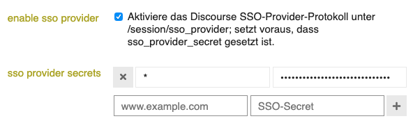

# Discourse SSO for Spring (Boot) Security

With this library you can use Discourse as a SSO provider for your Spring
(Boot) application.

## Discourse SSO Provider

The Discourse SSO provider is described on
[meta.discourse.org](https://meta.discourse.org/t/using-discourse-as-a-sso-provider/32974).

Discourse SSO provider must be enabled and configured with a (site specific) secret inside the admin settings.



### SSO Flow Summary

1. Redirect to `DISCOURSE_ROOT_URL/session/sso_provider?sso=PAYLOAD&sig=SIGNATURE`, where
   - `sso` is a Base64 & URL encoded payload consisting of a `nonce` and a `return_sso_url`
   - `sig` is a HMAC-SHA256 signature of the Base64 encoded payload
2. Login procedure or instant redirect from Discourse to the `return_sso_url`
3. Validate and process response parameters `sso` and `sig`
   - Compute signature of `sso` and compare with `sig`
   - Validate `sso.nonce`
   - Create Spring Security Authentication from `sso` payload

## spring-discourse-sso-autoconfigure

This project comes with AutoConfiguration support.

- Add `spring-discourse-sso-autoconfigure` dependency:

```
<dependency>
    <groupId>org.ollide</groupId>
    <artifactId>spring-discourse-sso-autoconfigure</artifactId>
    <version>CURRENT_RELEASE</version>
</dependency>
```

- Configure `spring-discourse-sso` inside your `application.properties`:

```
discourse.sso.secret=***************
discourse.sso.discourseUrl=https://<<DISCOURSE_DOMAIN>>/session/sso_provider
```

- Optional customizations:

  - The application's login endpoint defaults to `/login/discourse` and can
  be customized with the property `discourse.sso.loginPath`
  
  - The `return_sso_url` defaults to `/login/discourse/success` and can be
  customized with the property `discourse.sso.returnPath`

## spring-discourse-sso

If you don't want to use AutoConfiguration support, you must use
`spring-discourse-sso` directly:

```
<dependency>
    <groupId>org.ollide</groupId>
    <artifactId>spring-discourse-sso</artifactId>
    <version>CURRENT_RELEASE</version>
</dependency>
```

The key components to look for are:
- `DiscourseSigner`: Takes the SSO secret, signs & validates the payloads
- `SsoEndpoint`: Triggers the redirect to Discourse
- `DiscourseSsoVerificationFilter`: ServletFilter for the response, validates and attempts authentication
- `DiscoursePrincipal`: The Principal that can be accessed through Spring's SecurityContext after successful
authentication
